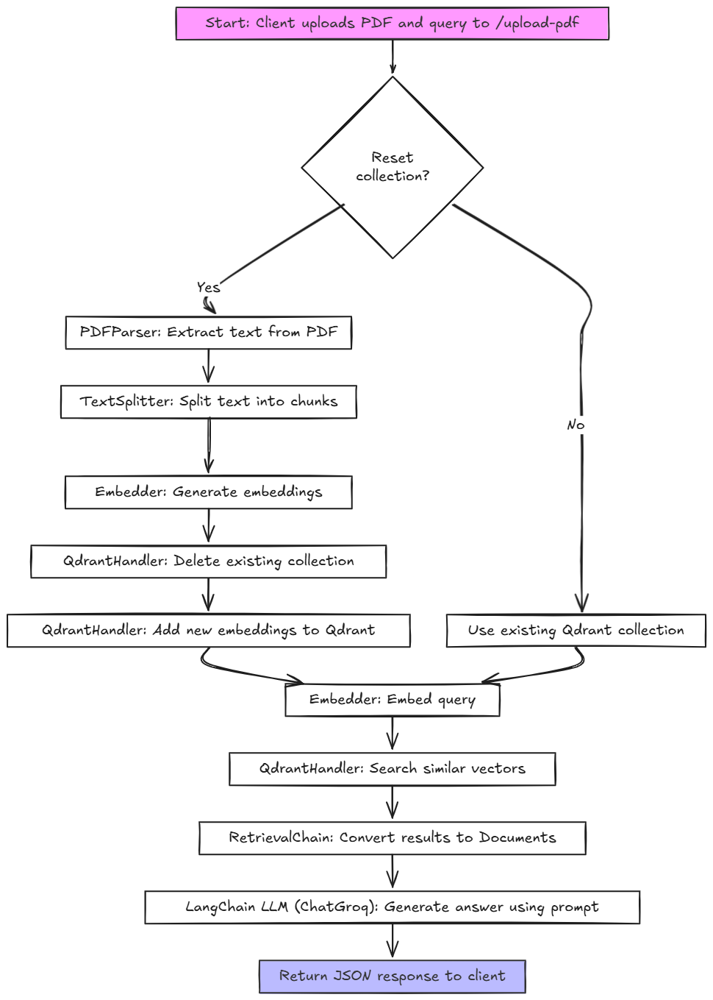

## Steps to run the application

1. Create a .env file and keep the variables same as example_env.env
2. Go to the backend directory from another terminal and run the main.py
    ```
    cd Backend
    python main.py
    ```
    - This will run on localhost:5001

  - Make sure the qdrant database is up and running.

3. Run this cURL to test.
    ```
    curl --location 'http://localhost:5001/upload-pdf' \
      --form 'reset_collection="true"' \
      --form 'query="Your query"' \
      --form 'file=@"path-to-pdf-file"'
    ```

4. If once pdf is uploaded and you don't want to upload the pdf again then make this change in cURL.
    ```
    reset_collection = "false"
    ```

## Architecture
